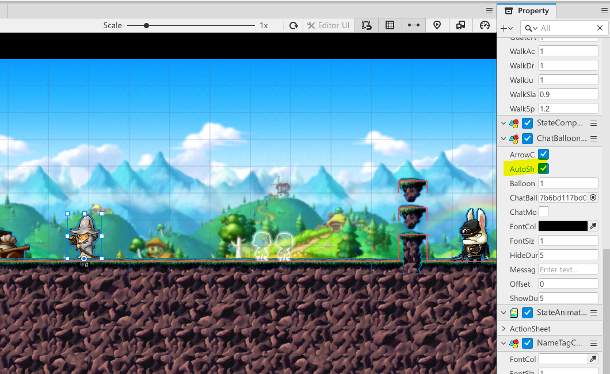
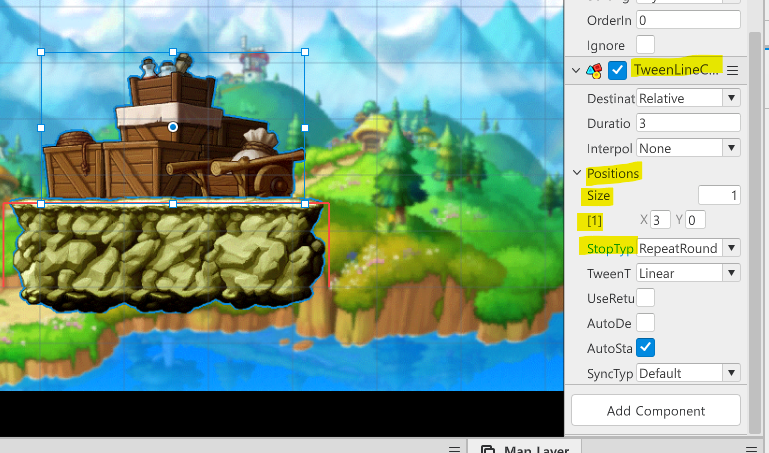
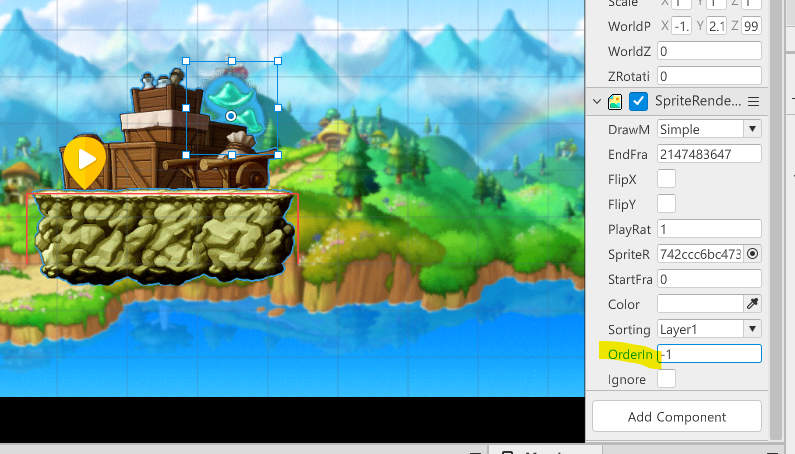
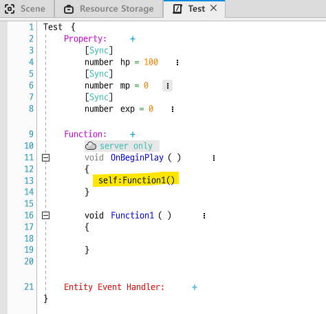

## [MOD 강좌 Chapter 1] 기본의 이해

- preset list에서 타일..등을 가져오기

  

- publishing을 통한 게임 출시

  

- map list를 통해 여러개의 맵을 저장

  

- maplestory map을 통해 다양한 맵을 불러올 수 있음

  

- 여기서 시작을 통해 시작위치 설정

  

- npc의 property 중, AutoShowEnable을 활성화하고 메세지를 적어주면 말풍선이 뜸

  

  

- 새 그룹 추가로 내가 쓰는 것들만 따로 모아두기

  
  
  

- workspace에서 model과 script 관리 / 엔티티의 원본 모델이 저장됨

  

- Add Component를 통해 객체에 속성 부여 가능

  

  (**TweenLineComponent **=> 시작점과 목적점 사이를 이동)

  

  

  (**ClimbableComponent **=> 객체에 올라갈 수 있도록 해줌)

  

- layer를 추가할 수 있음 => 타일이나 객체를 여러개 사용 가능

  

- 객체 여러개가 겹칠 때, OrderInLayer로 배치 가능

  

- Script 생성

  

  

  (**Property**)

  

  

  (**Function**)

  

  

  - OnBeginPlay : 게임이 처음 시작할때
  - OnUpdate : update 될때마다
  - OnEndPly : 객체가 파괴됐을때

  

  - new를 통해 새로운 함수를 생성할 수도

  

  - 추가한 function을 불러올 수도 있음

  (**Entity Event Handler**)

  => 엔티티에서 발생되는 다양한 event를 추가

  

  

  (**메서드 자체의 속성**)

  

  

  - server에서만 / client에서만 / 둘다 상관없이 무조건 실행되게

- 작성한 Script를 **Plain Text** 형태로 볼 수도 있음

  

- 기본 component들은 **SpriteRenderComponent**로 설정되어 있음

  

  (**Sprite RUID**를 통해 이미지들을 바로 변경하거나, 해당 RUID를 활용해 같은 객체를 만들 수 있음)

  

  

- **resource** 직접 추가하기

  

  

  

  

  

  

  (**이미지 슬라이싱**)

  

  

  

  
  
  
  
  
